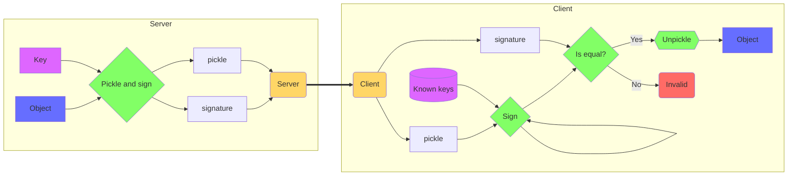

# SafePickling

SafePickling is a python library that allows you to sign and verify python pickles.



## Installation

```sh
pip install safepickling
```

## Usage Example

```python
object = ExampleObject()

server = SafePickling() # Create a server instance
server.generate_key() # Generate a random key for the server
pickled_object = server.pickle(object) # Pickle the object and sign it
```
```python
client = SafePickling() # Create a client instance
client.add_trusted_keys([server.key]) # Add the server's key to the client's trusted keys
unpickled_object = client.unpickle(pickled_object) # Unpickle the data while verifying it's signature with the server's key
```

## Cryptography

Random provided by `secrets.token_bytes`

Hash comparison with `hmac.compare_digest`

Hashing done using `hashlib.blake2b`
